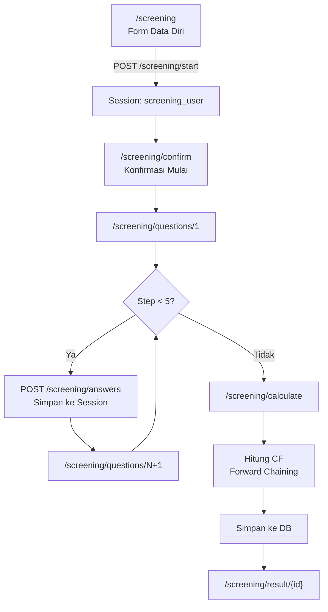

# Alur Screening - Expert System Skizofrenia

Dokumentasi lengkap tentang bagaimana sistem screening bekerja, lokasi logika, dan implementasi perhitungan Certainty Factor.

---

## 📍 Lokasi File Utama

| Komponen       | File                                                                                                                                                                                                                                                                                                                                 |
| -------------- | ------------------------------------------------------------------------------------------------------------------------------------------------------------------------------------------------------------------------------------------------------------------------------------------------------------------------------------ |
| **Routes**     | [web.php](file:///Users/macbookair/ES_Skyzofrenia/routes/web.php#L28-35)                                                                                                                                                                                                                                                             |
| **Controller** | [ScreeningController.php](file:///Users/macbookair/ES_Skyzofrenia/app/Http/Controllers/ScreeningController.php)                                                                                                                                                                                                                      |
| **Models**     | [Gejala.php](file:///Users/macbookair/ES_Skyzofrenia/app/Models/Gejala.php), [Diagnosis.php](file:///Users/macbookair/ES_Skyzofrenia/app/Models/Diagnosis.php), [Rule.php](file:///Users/macbookair/ES_Skyzofrenia/app/Models/Rule.php), [HasilDiagnosis.php](file:///Users/macbookair/ES_Skyzofrenia/app/Models/HasilDiagnosis.php) |
| **Views**      | `resources/views/public/screening/`                                                                                                                                                                                                                                                                                                  |

---

## 🔄 Diagram Alur Eksekusi



---

## 📋 Step-by-Step Alur

### Step 1: Form Data Diri

**URL:** `/screening`  
**Method:** `index()`

User mengisi: nama, umur, email, alamat, telepon

---

### Step 2: Simpan ke Session

**URL:** `POST /screening/start`  
**Method:** `start()`

```php
session([
    'screening_user' => [...],      // Data diri
    'screening_answers' => [],      // Jawaban kosong
]);
```

---

### Step 3: Konfirmasi

**URL:** `/screening/confirm`  
**Method:** `confirm()`

Halaman konfirmasi sebelum memulai pertanyaan.

---

### Step 4: Pertanyaan (5 Kategori)

**URL:** `/screening/questions/{step}`  
**Method:** `questions($step)`

| Step | Kategori       |
| ---- | -------------- |
| 1    | Gejala Positif |
| 2    | Gejala Negatif |
| 3    | Disorganisasi  |
| 4    | Prodromal      |
| 5    | Umum           |

**Query Database:**

```php
$gejalas = Gejala::where('kategori', $kategori)->orderBy('kode')->get();
```

---

### Step 5: Simpan Jawaban

**URL:** `POST /screening/answers`  
**Method:** `storeAnswers()`

```php
$currentAnswers = array_merge($currentAnswers, $answers);
session(['screening_answers' => $currentAnswers]);
```

---

### Step 6: Perhitungan CF

**URL:** `/screening/calculate`  
**Method:** `calculate()`

**Ini adalah inti logika sistem pakar!**

---

## 🧮 Implementasi Certainty Factor

### Bobot CF User (Jawaban)

```php
$cfUserValues = [
    'tidak'         => 0.0,
    'tidak_tahu'    => 0.2,
    'sedikit_yakin' => 0.4,
    'cukup_yakin'   => 0.6,
    'yakin'         => 0.8,
    'sangat_yakin'  => 1.0,
];
```

---

### Rumus Perhitungan

#### 1. CF Kombinasi (Per Gejala)

```
CF_kombinasi = CF_pakar × CF_user
```

**Contoh:**

-   CF Pakar = 0.8 (dari database)
-   CF User = 0.6 (cukup yakin)
-   CF Kombinasi = 0.8 × 0.6 = **0.48**

---

#### 2. CF Gabungan (Akumulasi)

```
CF_gabungan = CF_old + CF_new × (1 - CF_old)
```

**Implementasi:**

```php
if ($isFirstRule) {
    $cfCombined = $cfKombi;
} else {
    $cfCombined = $cfCombined + ($cfKombi * (1 - $cfCombined));
}
```

**Contoh Akumulasi:**
| Step | CF_old | CF_new | Perhitungan | CF_gabungan |
|------|--------|--------|-------------|-------------|
| 1 | 0 | 0.48 | 0 + 0.48×(1-0) | 0.48 |
| 2 | 0.48 | 0.32 | 0.48 + 0.32×(1-0.48) | 0.646 |
| 3 | 0.646 | 0.24 | 0.646 + 0.24×(1-0.646) | 0.731 |

---

### Forward Chaining

Hanya gejala dengan `CF_user > 0` yang diproses:

```php
if ($cfUser > 0) {
    // Process rule
}
```

Ini berarti jika user menjawab "Tidak" (CF=0), gejala tersebut **diabaikan** dalam perhitungan.

---

## 💾 Struktur Database

### Tabel `gejalas`

| Kolom    | Contoh                |
| -------- | --------------------- |
| kode     | G001                  |
| nama     | Mendengar suara-suara |
| kategori | Positif               |

### Tabel `diagnoses`

| Kolom | Contoh               |
| ----- | -------------------- |
| kode  | P001                 |
| nama  | Skizofrenia Paranoid |

### Tabel `rules`

| Kolom        | Contoh |
| ------------ | ------ |
| gejala_id    | 1      |
| diagnosis_id | 1      |
| cf_pakar     | 0.8    |

### Tabel `hasil_diagnosis`

Menyimpan hasil lengkap: jawaban, hasil CF, diagnosis utama.

---

## 🎯 Output Hasil

```php
$results[$diagnosis->kode] = [
    'diagnosis'     => $diagnosis,
    'cf_final'      => 0.731,          // Nilai CF final
    'cf_percentage' => 73.1,           // Persentase
    'details'       => [...],          // Detail perhitungan
];
```

**Sorting:** Hasil diurutkan dari CF tertinggi ke terendah.

---

## 📊 Interpretasi CF

| Range CF | Level         | Rekomendasi                 |
| -------- | ------------- | --------------------------- |
| ≥ 0.8    | Sangat Tinggi | Segera konsultasi psikiater |
| ≥ 0.6    | Tinggi        | Konsultasi profesional      |
| ≥ 0.4    | Sedang        | Perlu monitoring            |
| ≥ 0.2    | Rendah        | Gejala minimal              |
| < 0.2    | Sangat Rendah | Tidak terindikasi           |

---

## 🔍 Tips Mempelajari Kode

1. **Mulai dari routes** - Lihat alur URL
2. **Baca controller** - Fokus pada `calculate()` untuk logika CF
3. **Pahami models** - Relasi antar tabel
4. **Debug dengan dd()** - Tambahkan `dd($results)` sebelum redirect untuk melihat hasil
